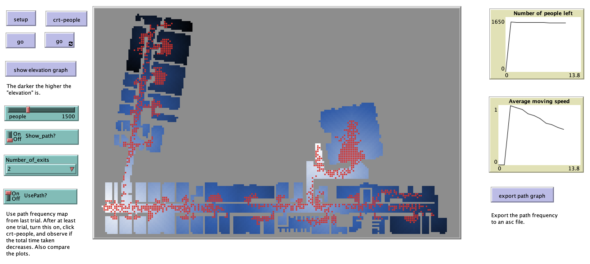

# Pedestrians Exiting Building

## Introduction

This model shows how one can use agent-based modleing to simuate pedestrians exiting a building. The configuration is based on a floor plan that has been first converted from a CAD file to a Shapefile  before being converted into a raster where each cell is 50cm by 50cm that can then be used in the NetLogo model.

Below is the graphical user interface of the model: 

Click on the image below to see a YouTube movie of the model:

The model was originally developed for: [http://www.abmgis.org/](http://www.abmgis.org/).