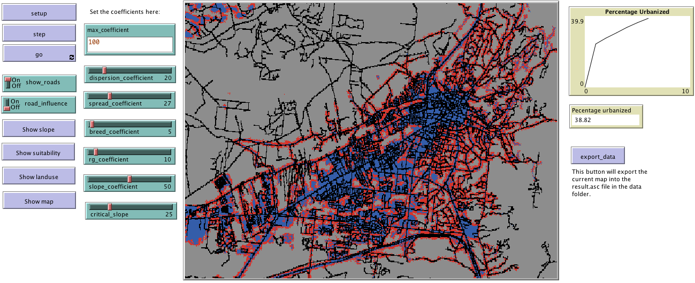
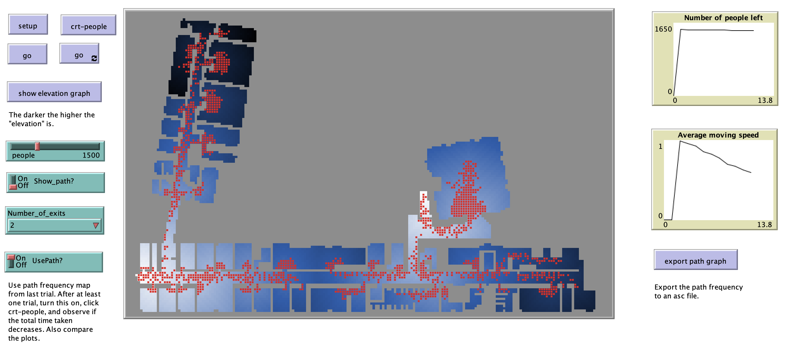

## UrbanSimulation

# About

This repository contains links and example models used in the Book Chapter pertaining to Urban Simulation. 

# ChatGPT 

Example of Using ChatGPT 4o with Canvas to create an agent-based model: <https://youtu.be/GBeyOhBQWAU>.  

# Examples Modeling Platforms for Urban Simulation 

* [**Anylogic**](https://www.anylogic.com/)
* [**MESA**](https://github.com/projectmesa/mesa/)
* [**Repast**](https://repast.github.io/)
* [**NetLogo**](https://ccl.northwestern.edu/netlogo/)
* [**GAMA**](https://gama-platform.org/)
* [**MATSim**](https://matsim.org/)
* [**TRANSIMS**](https://en.wikipedia.org/wiki/Transims)
* [**SLEUTH**](https://www.ncgia.ucsb.edu/projects/gig/)
* [**MASON**](https://cs.gmu.edu/~eclab/projects/mason/)
* [**DINAMICA**](http://csr.ufmg.br/dinamica/)
* [**Metronamica**](http://www.metronamica.nl/)
* [**UrbanSim**](https://www.urbansim.com/)
* [**UrbanSim**](https://www.urbansim.com/)
* [**PTV Visum**](https://www.ptvgroup.com/en-us/products/ptv-visum)
* [**TransModeler**](https://www.caliper.com/transmodeler/default.htm?srsltid=AfmBOookQOyT8H4WORuskFxM3KbH7MKI9KnkIvEef_cfDabjmtVLr5qG)
* [**Paramics**](https://www.systra.com/digital/solutions/transport-planning/paramics/)
* [**Legion**](https://www.bentley.com/software/legion/)
* [**Steps**](https://www.mottmac.com/en/digital-solutions/)
* [**EXODUS**](https://fseg.gre.ac.uk/exodus/)

# Examples of real world Agent-based Modeling Applications

A sample (and definitely not an exhaustive list) of agent-based modeling applications and references are provided below for interested readers:

* Southwest Airlines used an agent-based model to improve how it handled cargo (Seibel and Thomas, 2000).
* Eli Lilly used an agent-based model for drug development (Bonabeau, 2003a).
* Pacific Gas and Electric: Used an agent based model to see how energy flows through the power grid (Bonabeau, 2003a).
* Procter and Gamble used an agent-based model to understand its consumer markets (North et al., 2010) while Hewlett-Packard used an agent-based model to understand how hiring strategies effect corporate culture (Bonabeau, 2003b).
* Macy’s have used agent-based models for store design (Bonabeau, 2003b).
* NASDAQ used and agent based model to explore changes to Stock Market's decimalization (Bonabeau, 2003b; Darley and Outkin, 2007).
* Using a agent-based model to explore capacity and demand in theme parks (Bonabeau, 2000).
* Traffic and pedestrian modeling (Helbing and Balietti, 2011).
* Disease dynamics (e.g. Eubank et al., 2004).
* Agent-based modeling has also been used for wild fire training, incident command and community outreach (Guerin and Carrera, 2010). For example [SimTable](https://www.simtable.com/) was used in the  2016 Sand Fire in California. 
* [InSTREAM](https://www.humboldt.edu/ecological-modeling/instream-and-insalmo/instream-and-insalmo-overview): Explores how river salmon populations react to changes (Railsback and Harvey, 2002).

## References
**Bonabeau, E.** (2000), 'Business Applications of Social Agent-Based Simulation', Advances in Complex Systems, 3(1-4): 451-461.

**Bonabeau, E.** (2003a), 'Don’t Trust Your Gut', Harvard Business Review, 81(5): 116-123.

**Bonabeau, E.** (2003b), 'Predicting the Unpredictable', Harvard Business Review, 80(3): 109-116.

**Darley, V. and Outkin, A.V.** (2007), NASDAQ Market Simulation: Insights on a Major Market from the Science of Complex Adaptive Systems, World Scientific Publishing, River Edge, NJ.

**Eubank, S., Guclu, H., Kumar, A.V.S., Marathe, M.V., Srinivasan, A., Toroczkai, Z. and Wang, N.** (2004), 'Modelling Disease Outbreaks in Realistic Urban Social Networks', Nature, 429: 180-184.

**Guerin, S. and Carrera, F.** (2010), 'Sand on Fire: An Interactive Tangible 3D Platform for the Modeling and Management of Wildfires.' WIT Transactions on Ecology and the Environment, 137: 57-68.

**Helbing, D. and Balietti, S.** (2011), How to do Agent-based Simulations in the Future: From Modeling Social Mechanisms to Emergent Phenomena and Interactive Systems Design, Santa Fe Institute, Working Paper 11-06-024, Santa Fe, NM.

**North, M.J., Macal, C.M., Aubin, J.S., Thimmapuram, P., Bragen, M., Hahn, J., J., K., Brigham, N., Lacy, M.E. and Hampton, D.** (2010), 'Multiscale Agent-based Consumer Market Modeling', Complexity, 15(5): 37-47.

**Railsback, S.F. and Harvey, B.C.** (2002), 'Analysis of Habitat Selection Rules using an Individual-based Model', Ecology, 83(7): 1817-1830.

**Seibel, F. and Thomas, C.** (2000), 'Manifest Destiny: Adaptive Cargo Routing at Southwest Airlines', Perspectives on Business Innovation, 4: 27-33.

# SIR Models

To compare differnet modeling approaches to the same issue, in subfolder [SIR_Models](/SIR_Models/) folder you will find 4 models:

* **Cellular Automata** ([SIR_CA.nlogo](SIR_Models/SIR_CA.nlogo))
* **Discreet Event Simulation** ([SIR_DES.nlogo](SIR_Models/SIR_DES.nlogo))
* **System Dynamics Model** ([SIR_SD.nlogo](SIR_Models/SIR_SD.nlogo))
* **Agent-based Model** ([SIR_ABM.nlogo](SIR_Models/SIR_ABM.nlogo))

Each explores the spread of a disease using a a Susceptible-Infected-Recovered (SIR) epidemic model. For more details about SIR models see: <https://en.wikipedia.org/wiki/Compartmental_models_in_epidemiology>

# Example of a Urban Growth Model

To see an example of an CA Urban Growth model go to subfolder [UrbanGrowth](/UrbanGrowth/)

# Example of a Pedestrain Model

To see an example of an Agent-based model desinged to simuatiae people exiting a building go to subfolder [Pedestrian_Model](/Pedestrian_Model/)

